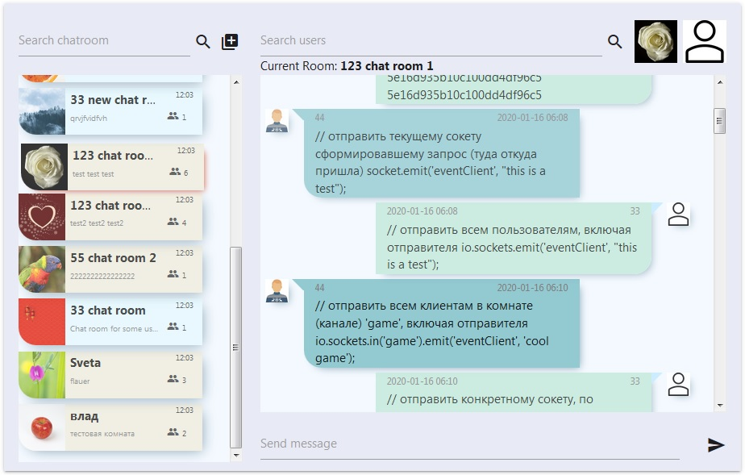

# chatApp
```html
<header style="	width: 100%;
		height: 3rem;
		line-height: 3rem;
		font-size: 1.4rem;
		color: white;
		text-align: center;
		background-color: #52bad5;">
  Chat app based on ReactJS, NodeJS, MongoDB, Websocket
</header>
<div>
  
</div>
```